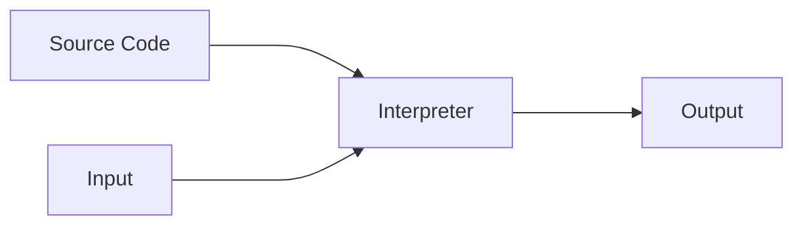
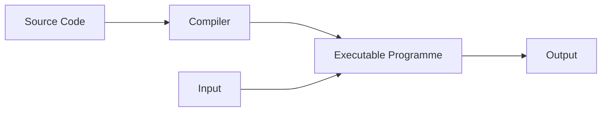
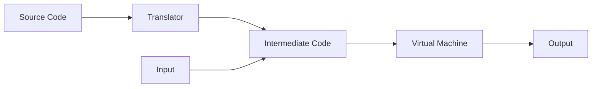
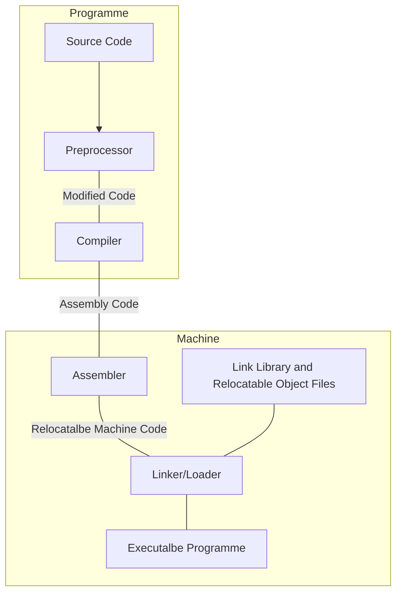
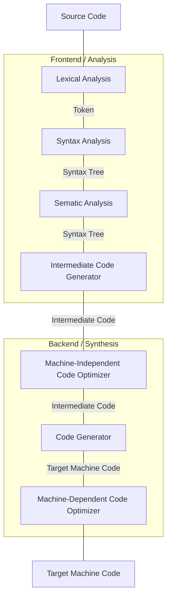
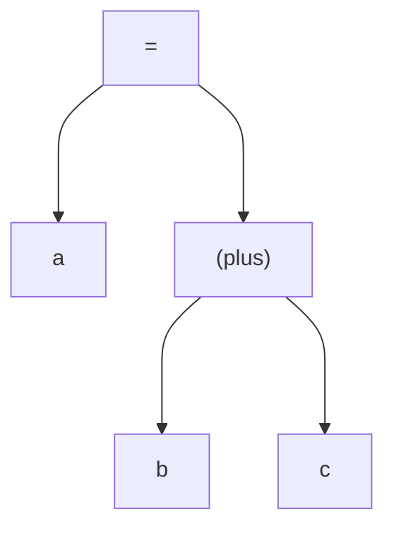

+++
title = 'Compiler - 00 Overview'
date = 2024-12-06T18:32:58+08:00
draft = false
summary = '引入编译器的一些基本常识'
categories = ['Computer Science', 'Compiler']

+++

> Before you read... 由于我的写作风格会包含很多对专业术语的缩写, 因此可能需要您对于计算机领域的一些基本知识以及词汇积累. 这也是为了您能在阅读更多教材或者是著作的时候能知道术语对应的意思是什么.

## Preface / 最前面的前面

其实, 自己动手写一门语言一直是我的愿望, 应为一开始是想自己动手写一个游戏引擎(因为想替代`Godot`, 音频之类的好像没有暴露Native API, 而且打包加密之后防逆向很差, 需要自己动手改源代码). 所以我就开始接触编译原理.

其实按照常规思维来讲, 编译器就是一个翻译器, 把高等语言(e.g. `C#`, `Rust`)翻译成中间码(e.g. Microsoft的`CLR`用的中间语言, `LLVM`的中间语言), 再交由后端优化翻译成机器码.

我们大多数时候聚焦于前端, 也就是把高等语言翻译成中间码, 后端一般来说可以直接用现成他人优化好的便可(`LLVM`), 当然, 如果说Geek那也可以自己搞定后端. 现在后端或许能融入ML使得生成的程序更加高效呢.

本文大部分举例可能会使用`C#`或者`Python`, 不熟悉可以先去学习一下其语法.

## 概念辨析: `Compiler`与`Interpreter`

简单来说, `Interpreter`是动态处理的, 通常来说需要一个`VM`来支持其动态性. 就例如说`Python`, 我们可以在终端直接去执行代码, 这也就是动态性. 其是可以在运行期间直接翻译并运行新来的代码, 并给出`Output`



看起来挺美妙的对吧? 代码可以及时的获取输出, 给予了很大的自由度. 但是自由总是带来限制, 首先就是性能是由`VM`决定的, 当然像`Python`的社群有很多的`VM`可供代替(e.g. `PyPy`, `IronPython`). 其次, 过度的自由带来的是`Debug`的麻烦, 应为不使用特殊的手段很难知道运行期间的`Symbol Table`(但是像`Python`有`IPython`联动`Notebook`查看`VM Memory`). 最后, 可能是对于我来说的一个缺点是很难做反编译, 当然第一种就是混淆变量名, 或者是下文混合态可以对于`VM`处理, 加壳保护`Memory`防止dump(当然`Dump Memory`是逆向获得源程序最后的底牌, 有很多`Unity`游戏都是可以用这个来获得必要的部分)

如果不要那么高的自由度, 那就是`Compiler`. `Compiler`是先编译程序再运行, 所以一切基本上是在编译前或者是编译期间定下来的, 也就是当得到可执行程序之后是不能再改动的(除非用了反编译更改). 



通常来说, 可执行程序的性能是由代码与编译器优化机器码所决定的, 所以也没有`VM`性能门槛. 当然, 由于一切都是在编译前或者编译期间定下来的, 因此`Symbol Table`很多都可以直接通过工具获取得到(e.g. `IDA Pro`). 也能在编译期间发现很多有关于类型错误等隐形错误, 这些是`Interpreter`所无法触及的. 但`Interpreter`可以提供更多错误信息以供`Debug`

还有另外一种混合态, 也就是前端翻译成机器码, 后端使用`VM`来翻译成机器码. 最典型的例子就是Microsoft的`C#`(后端`VM`: `CLR`)和`Java`(后端`VM`: `Hotspot`以及其代替者们). 他们都是使用了前端编译后端翻译机器码的. 中间码被称为`bytecode`. 当然, 混合态也可以当作`Interpreter`用(`C#`也有终端可以即时的执行代码, 这个功能在`Jetbrains Rider`中有). 当然, 这样最大的优势之一就是一端编译多端运行(当然那一端也需要由对应的`VM`实现)

> [!TIP]
>
> 其实`Lua`也是这种混合态



当然, 有些`VM`为了更高的性能, 还会采用一种策略称为`Just-in-Time`编译, 也就是在运行`bytecode`之前先把`bytecode`编译成`Machine Code`, 这样直接执行在机器上可以拥有约等于`Compiler`编译出来的可执行文件的效率.

## 一个编译器该长啥样?

一个理想的编译流程可以由`Preprocessor`, `Compiler`, `Assembler`和`Linker/Loader`组成.



有些时候, `Compiler`可以不处理`Assembly Code`部分, 也就是后端, 后端可以交给成熟的后端以求得更优化的`Assembly Code`

一个理想的, 包含前端后端的编译器应该包含以下步骤: `Lexical Analysis`, `Syntax Analysis`, `Sematic Analysis`, `Intermediate Code Generator`, `Machine-Independent Code Optimizer`, `Code Generator`和`Machine-Dependent Code Optimizer`



我们通常把编译器分为前端和后端, 前端主要的工作为分析以及生成中间码(这也是我们主要聚焦的地方), 后端主要的工作是优化中间码并生成目标机器码. 当然, 我们还有一个称作`Symbol Table`用于存放源代码所有的符号.

接下来我们逐步的讲解前端每一块都是干什么的.

### Lexical Analysis 词法分析

这一块的主要工作是分析源代码中的字符并归类成有用的小块(`Lexemes`). 

首先是状态转换, 通常你可以在一些`Compiler`的词法分析部分发现这样的表

```
{Token, TokenType}
```

这样便可以把零星的字符串给予不同的属性, 区分是字符串还是符号, 或者是换行之类(这样可以处理使用分号断句的语言)

就例如说处理这一句: `Console.WriteLine("Hello, World!");`

我们可以切割为以下的表

| Token       | Token Type |
| ----------- | ---------- |
| `Console`   | string     |
| `.`         | symbol     |
| `WriteLine` | string     |
| `(`         | symbol     |
| `"`         | symbol     |
| `Hello`     | string     |
| `,`         | symbol     |
| `World`     | string     |
| `"`         | symbol     |
| `)`         | symbol     |

通常来说, 特殊符号特殊处理, 例如说`\n` `;`等将会特殊处理, 当然我举的例子不是全部, 更复杂的语言体系对应的`Token Type`还会更复杂.

那具体要怎么扫描呢? 想想你是个状态机, 然后语言体系规定了一系列的判定标准. 你要一个字符一个字符的扫描. 我先拿比较复杂的字符串举例, 其他类型就在字符串之上做删减便可.

首先你先扫到了一个英文字符, 进入`String`判定模式, 这个字符存入`Buffer`. 开始向前扫描, 扫呀扫, 终于扫到了一个非英文字符的字符(例如空格), 回头看一下`Buffer`的最后一个字符是不是英文字符, 如果是, 那就判定`Buffer`中的内容为`String`, 结束`String`判定模式并把`Buffer`中的东西提交到状态转换表中开始下一次的检测.

当然, 这种当然可以适用于不打空格的坏小孩~例如说: `int a=5;`这种编码习惯.

### Syntax Analysis 语法分析

顾名思义, 这一阶段主要是处理你的代码是否符合这个语言所规定的语法. 检查的通常手段是匹配语法模板, 有些语言由于要兼顾高效编码, 还会使用产生式匹配同时并列相同的语句, 例如说`int a, b, c;` `int func(int a, int b);`等. 等匹配完, 我们也就便知道了这和语句的语法结构, 通常使用一种树状表示来代表语法结构, 就例如说这个赋值语句`a=b+c;`



然后便可交给`Sematic Analysis`做下一步检测.

### Sematic Analysis 语义检测

我们之前有说过, `Compiler`的好处就在于可以防范于未然-检测隐形错误. 例如说类型错误等. 这都要归功于语义检测, 在这一阶段, `Compiler`还有可能进行隐式处理, 例如说浮点数类型的转换等.

### Intermediate Code Generator 中间代码生成

接下来就是输出中间码交给后端处理, 有很多`Compiler`会把中间码输出成类机器码便于后端处理.

当然在这一阶段`Compiler`也会进行一定的优化.

毕竟中间码基本上你也不会审查(写代码的时候干嘛去了), 除非前端后端不是同个程序且你有且愿意优化中间码的能力. 如果是成熟的`Compiler`和后端, 这一个基本上你不需要特别的处理.

### Backend 后端部分

我们可以看到, 后端都是从一般到特殊, 先进行非机器特性的优化, 输出第二中间码给生成器输出汇编, 再交给机器特性优化, 接下来交给汇编器出来的就是特定机器特定运行的程序.

这一块最鲜明的地方就是交叉编译, 这就是从一般到特殊的过程, 一端可以编译多端.

### Symbol Table 符号表

符号表是`Compiler`用于记录代码中所有变量等信息的键值表, 可以特定`Compiler`特定优化设计以方便`Compiler`快速获得变量的信息

## 一个语言最基本的知识

> 我觉得吧, 这玩意应该在学语言的时候就搞懂, 当然我也再写一遍

### Dynamic和Static策略

两个策略最大的不同在于确定变量的时间, static确定变量的时间在于编译时, 而dynamic确定变量的时间在于运行时. 通常来说, static发现问题的时间在编译时就知道了.

并且static也可以一定程度上的避免内存竞争等.(毕竟变量在编译时就确定了, 别的语句没办法把名字改为同样, 避免多指一)

### 环境与状态

这里我们用类距离, 对于有类的语言, 大家都知道可以在类中声明一些变量, 例如这个例子

```python
class Sample:
    def __init__(self, num):
        self.a = num
        
    def plus(self, num):
        self.a += num
	
```

在这个例子中, 我们对于这整个类所拥有的变量新声明了一个变量`a`. 在`plus`函数, 我们修改了名称为`a`的变量的值, 这就体现了环境与状态的关系.

变量有名称, 变量在环境中(例如说类), 我们使用变量的名称去指定那个变量. 这个变量在环境中有一个值, 称之为状态. 如果我们用键值表的表达可能会更直观的表示

```python
Env[VariName] = State
```

但是, 名称对应的环境可以修改, 例如说即时变量, 这个将在作用域中讲到.

### 作用域

> 如果弄清楚Rust, 这个确实会明确很多...

简单来说, 就是谁属于谁的一个问题, 块内变量无法被块外变量所使用, 例如说下面这个例子

```C
int i, x;

void func(...) {
    // Block A
    int i = 3;
}

//Code A
x = i + 1;
```

很明显, Code A的`i`是`func()`上面声明的`i`而并非是`func()`内声明的`i`.

当然, 像`C#`等语言通过创造更多的修饰符(例如说`public`, `private`等)使得作用域可以特殊访问.

还有些语言的作用域是动态的, 也就是说, 在出`Block`之后, 变量仍未终止, 在`Block`之外也是可以用的.

## 一个编译器比较细致的运行机理

> [!WARNING]
>
> 这个部分还在施工中, 等过几日再来看吧~
